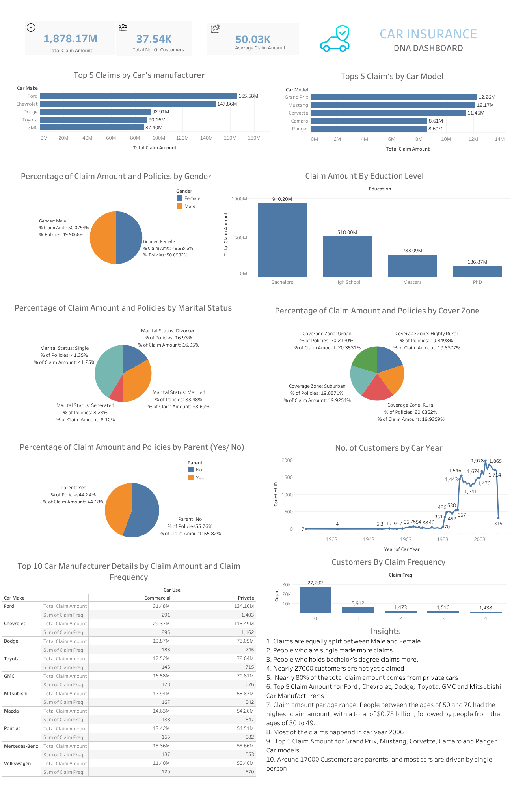

# Car Insurance Claim Analysis

## Project Title : 
Car Insurance Claim Analysis - Data visualization (Using Tableau)

## Project Description : 
Analysing the car insurance and claim data to gain meaningful insights from raw data to support decision-making, identify patterns, and extract valuable information with the help of Data visualization tool - Tableau. 

This will give meaning will insights and insights will lead to recommendations help in business to strategies for growth.

## Link to the Dashboard

<a href="https://public.tableau.com/app/profile/harish.kashaboina/viz/CarInsurance_16922490987810/Dashboard1" target="_blank" rel="noopener noreferrer">
  Car Insurance Claim Dashboard
</a>

##  Super Store Dashboard

## Data preview 
Dataset contains 21 columns and are like - 
1. id:	Customer's record ID
2. birthdate: Customer's Birthday (mm/dd/yyyy)
3. marital_status: Customer's maritla status
4. car_use: The reason of having a car: private, commercial
5. gender: Customer's gender 
6. kids_driving: No of Customers using the same car
7. parent: Is Customer a parents?
8. education: Customer's edcation level 
9. car_make: Car's manufacturer
10. car_model: Car's model 
11. car_color: Car's colour
12. car_year: The year that the car is in manufacture
13. claim_freq: How many time customer claim insurance 
14. coverage_zone: What is the coveragezone
15. claim_amt: Claim amount
16. household_income: Household income 

## Insights: 

1. Claims are equally split between Male and Female
2. People who are single made more claims
3. People who holds bachelor's degree claims more.
4. Nearly 27000 customers are not yet claimed
5. Nearly 80% of the total claim amount comes from private cars
6. Top 5 Claim Amount for Ford , Chevrolet, Dodge, Toyota, GMC and Mitsubishi Car Manufacturer's
7. Claim amount per age range. People between the ages of 50 and 70 had the highest claim amount, with a total of $0.75 billion, followed by people from the ages of 30 to 49.
8. Most of the claims happend in car year 2006
9. Top 5 Claim Amount for Grand Prix, Mustang, Corvette, Camaro and Ranger Car models
10. Around 17000 Customers are parents, and most cars are driven by single person

## Tools and Language : 

Jupyter Notebook (Python) : Used for basic understanding like structure of data (row and columns), checking null values, handling missing values etc.

Tableau : For visualization of data,interactivity and seamless experience that comes with the dashboard. 

## Link to the Tableau Profile

<a href="https://public.tableau.com/app/profile/harish.kashaboina" target="_blank" rel="noopener noreferrer">
 My Tableau Profile
</a>